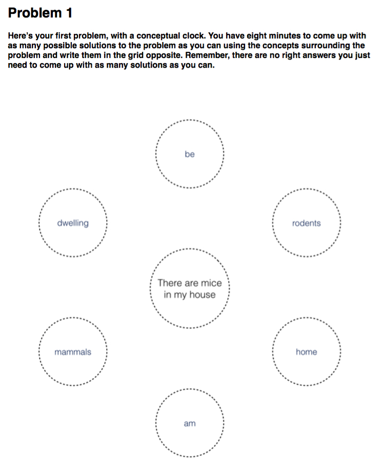

```{r message = FALSE, warning = FALSE}
library("papaja")
```

```{r message = FALSE, warning = FALSE}
# libraries
library(gdata)
# This is needed to import Excel files

# If not installed:
# install.packages("lsr") # For cohensD
library(lsr)

# 'ez' library is needed for ANOVA etc.
library(ez)

# To read SPSSS data, make sure the dataset is saved as .por (portable)
# Then we need:
# install.packages('memisc') # To download the memisc package
# Once successful, then we can:
library(memisc)

# The psych library has some good functions, like ICC
library(psych)

# Get the SPSS data
data <- as.data.set(spss.portable.file("../data.por"))


# functions

## This trims the lead zero from a number
## To be used at the point it is displayed
## Only if the value cannot exceed 1
trimLeadZero <- function(val) { sub("^(-?)0.", "\\1.", sprintf("%.2f", val)) }

## This is given a p value and formats it
## for use in an APA document
getApaP <- function(x) {
if (x < 0.001) {
  apaP = "< .001"
} else {
  apaP = paste("=",toString(x))
}
return(apaP)
}

```

```{r create_variables}

##############################################################################################
######### Participants and other descriptives
##############################################################################################
numWomen = sum(data$tgender == 'F')
numParticipants = length(data$tpartici)
numMen = sum(data$tgender == 'M')
numUndisclosed = sum(is.missing(data$lage))
meanAge = round(mean(data$lage),2) # Rounded to 2 decimal places
lowerAgeBound = min(range(data$lage))
upperAgeBound = max(range(data$lage))

bookletA <- subset(data, tbooklet == "A")
bookletB <- subset(data, tbooklet == "B")
bookletC <- subset(data, tbooklet == "C")
bookletD <- subset(data, tbooklet == "D")
bookletA_C <- subset(data, tbooklet == "A_C")
bookletB_C <- subset(data, tbooklet == "B_C")
bookletC_C <- subset(data, tbooklet == "C_C")
bookletD_C <- subset(data, tbooklet == "D_C")

totalControl=NROW(bookletA_C) + NROW(bookletB_C) + NROW(bookletC_C) + NROW(bookletD_C)
totalNearAndFar=NROW(bookletA) + NROW(bookletB) + NROW(bookletC) + NROW(bookletD)

# #############################################################################################
######### Preparation for intra-class correlations
##############################################################################################

# Put coder values for mean flexibility into a matrix, pairwise, ready for
# Intra Class Correlations
tlFlexibilityMatrix = matrix(c(data$tflexibi, data$lflexibi),nrow=171,ncol=2)

# Run ICC (for more on this, see help(psych))
# see https://en.wikipedia.org/wiki/Intraclass_correlation

# ICCs scale from 0-1 and indicate shared variance
iccFlexOutput = ICC(tlFlexibilityMatrix,missing=TRUE,alpha=.05)

# iccOutput is a list; unlist is to make it vector
iccFlexOutputUl = unlist(iccFlexOutput)

# Now it's a vector, we can pull parts of the output
# for inclusion in the paper (use unlist function
# so that the resulting variables are not themselves lists)
iccFlexCoefficient <- unlist(iccFlexOutputUl[7])
iccFlexCoefficientF <- unlist(iccFlexOutputUl[13])
iccFlexCoefficientFdfN <- unlist(iccFlexOutputUl[19])
iccFlexCoefficientFdfD <- unlist(iccFlexOutputUl[25])
iccFlexCoefficientCIl <- unlist(iccFlexOutputUl[37])
iccFlexCoefficientCIu <- unlist(iccFlexOutputUl[43])

# Calculate p for F precisely 
iccFlexCoefficientFp <- pf(iccFlexCoefficientF, iccFlexCoefficientFdfN, iccFlexCoefficientFdfD, lower.tail=F)

#############################

# Put coder values for mean flexibility into a matrix, pairwise, ready for
# Intra Class Correlations
tlQualityMatrix = matrix(c(data$ctqovera, data$clqovera),nrow=171,ncol=2)

# Run ICC (for more on this, see help(psych))
# see https://en.wikipedia.org/wiki/Intraclass_correlation

# ICCs scale from 0-1 and indicate shared variance
iccQualOutput = ICC(tlQualityMatrix,missing=TRUE,alpha=.05)

# iccOutput is a list; unlist is to make it vector
iccQualOutputUl = unlist(iccQualOutput)

# Now it's a vector, we can pull parts of the output
# for inclusion in the paper (use unlist function
# so that the resulting variables are not themselves lists)
iccQualCoefficient <- unlist(iccQualOutputUl[7])
iccQualCoefficientF <- unlist(iccQualOutputUl[13])
iccQualCoefficientFdfN <- unlist(iccQualOutputUl[19])
iccQualCoefficientFdfD <- unlist(iccQualOutputUl[25])
iccQualCoefficientCIl <- unlist(iccQualOutputUl[37])
iccQualCoefficientCIu <- unlist(iccQualOutputUl[43])

# Calculate p for F precisely 
iccQualCoefficientFp <- pf(iccQualCoefficientF, iccQualCoefficientFdfN, iccQualCoefficientFdfD, lower.tail=F)


##############################################################################################
######### Preparation for pre-questionnaire items
##############################################################################################

# 'How creative do you think you are?'

## subset of those in experimental group; creates new dataframes
hcmExp <- subset(data, cconditi == "nearFar", tqhowcre)
hcmCon <- subset(data, cconditi == "control", tqhowcre)

## Get the means
hCeM <- mean(hcmExp$tqhowcre)
hCcM <- mean(hcmCon$tqhowcre)

## Get the SDs
hCeS <- sd(hcmExp$tqhowcre)
hCcS <- sd(hcmCon$tqhowcre)

# 'How important do you think creativity is in life?'

## subset of those in experimental group; creates new dataframes
himExp <- subset(data, cconditi == "nearFar", tqhowimp)
himCon <- subset(data, cconditi == "control", tqhowimp)

## Get the means
hIeM <- mean(himExp$tqhowimp)
hIcM <- mean(himCon$tqhowimp)

## Get the SDs
hIeS <- sd(himExp$tqhowimp)
hIcS <- sd(himCon$tqhowimp)

# Grand means; SDs
hCm <- mean(hCeM, hCcM)
hIm <- mean(hIeM, hIcM)
hCs <- sd(data$tqhowcre)
hIs <- sd(data$tqhowimp)


##############################################################################################
######### Preparation for looking at creative DVs by Problem 1 (near/far), Problem 2 (near/far), Control
##############################################################################################


# Computing the DV subsets, means and SDs for P1 and P2

## Fluency: subsets, means and SDs
fluP1near = subset(data$cp1fluen, data$tbooklet == "A" | data$tbooklet == "B")
fluP1farr = subset(data$cp1fluen, data$tbooklet == "C" | data$tbooklet == "D")
fluP2near = subset(data$cp2fluen, data$tbooklet == "C" | data$tbooklet == "D")
fluP2farr = subset(data$cp2fluen, data$tbooklet == "A" | data$tbooklet == "B")

fluP1nearM = mean(subset(data$cp1fluen, data$tbooklet == "A" | data$tbooklet == "B"))
fluP1farrM = mean(subset(data$cp1fluen, data$tbooklet == "C" | data$tbooklet == "D"))
fluP2nearM = mean(subset(data$cp2fluen, data$tbooklet == "C" | data$tbooklet == "D"))
fluP2farrM = mean(subset(data$cp2fluen, data$tbooklet == "A" | data$tbooklet == "B"))

fluP1nearS = sd(subset(data$cp1fluen, data$tbooklet == "A" | data$tbooklet == "B"))
fluP1farrS = sd(subset(data$cp1fluen, data$tbooklet == "C" | data$tbooklet == "D"))
fluP2nearS = sd(subset(data$cp2fluen, data$tbooklet == "C" | data$tbooklet == "D"))
fluP2farrS = sd(subset(data$cp2fluen, data$tbooklet == "A" | data$tbooklet == "B"))

## Quality: subsets, means and SDs
quaP1near = subset(data$cp1quali, data$tbooklet == "A" | data$tbooklet == "B")
quaP1farr = subset(data$cp1quali, data$tbooklet == "C" | data$tbooklet == "D")
quaP2near = subset(data$cp2quali, data$tbooklet == "C" | data$tbooklet == "D")
quaP2farr = subset(data$cp2quali, data$tbooklet == "A" | data$tbooklet == "B")

quaP1nearM = mean(subset(data$cp1quali, data$tbooklet == "A" | data$tbooklet == "B"))
quaP1farrM = mean(subset(data$cp1quali, data$tbooklet == "C" | data$tbooklet == "D"))
quaP2nearM = mean(subset(data$cp2quali, data$tbooklet == "C" | data$tbooklet == "D"))
quaP2farrM = mean(subset(data$cp2quali, data$tbooklet == "A" | data$tbooklet == "B"))

quaP1nearS = sd(subset(data$cp1quali, data$tbooklet == "A" | data$tbooklet == "B"))
quaP1farrS = sd(subset(data$cp1quali, data$tbooklet == "C" | data$tbooklet == "D"))
quaP2nearS = sd(subset(data$cp2quali, data$tbooklet == "C" | data$tbooklet == "D"))
quaP2farrS = sd(subset(data$cp2quali, data$tbooklet == "A" | data$tbooklet == "B"))

## Flexibility: subsets, means and SDs
fleP1near = subset(data$cp1flexi, data$tbooklet == "A" | data$tbooklet == "B")
fleP1farr = subset(data$cp1flexi, data$tbooklet == "C" | data$tbooklet == "D")
fleP2near = subset(data$cp2flexi, data$tbooklet == "C" | data$tbooklet == "D")
fleP2farr = subset(data$cp2flexi, data$tbooklet == "A" | data$tbooklet == "B")

fleP1nearM = mean(subset(data$cp1flexi, data$tbooklet == "A" | data$tbooklet == "B"))
fleP1farrM = mean(subset(data$cp1flexi, data$tbooklet == "C" | data$tbooklet == "D"))
fleP2nearM = mean(subset(data$cp2flexi, data$tbooklet == "C" | data$tbooklet == "D"))
fleP2farrM = mean(subset(data$cp2flexi, data$tbooklet == "A" | data$tbooklet == "B"))

fleP1nearS = sd(subset(data$cp1flexi, data$tbooklet == "A" | data$tbooklet == "B"))
fleP1farrS = sd(subset(data$cp1flexi, data$tbooklet == "C" | data$tbooklet == "D"))
fleP2nearS = sd(subset(data$cp2flexi, data$tbooklet == "C" | data$tbooklet == "D"))
fleP2farrS = sd(subset(data$cp2flexi, data$tbooklet == "A" | data$tbooklet == "B"))

## Originality: subsets, means and SDs
oriP1near = subset(data$cp1origi, data$tbooklet == "A" | data$tbooklet == "B")
oriP1farr = subset(data$cp1origi, data$tbooklet == "C" | data$tbooklet == "D")
oriP2near = subset(data$cp2origi, data$tbooklet == "C" | data$tbooklet == "D")
oriP2farr = subset(data$cp2origi, data$tbooklet == "A" | data$tbooklet == "B")

oriP1nearM = mean(subset(data$cp1origi, data$tbooklet == "A" | data$tbooklet == "B"))
oriP1farrM = mean(subset(data$cp1origi, data$tbooklet == "C" | data$tbooklet == "D"))
oriP2nearM = mean(subset(data$cp2origi, data$tbooklet == "C" | data$tbooklet == "D"))
oriP2farrM = mean(subset(data$cp2origi, data$tbooklet == "A" | data$tbooklet == "B"))

oriP1nearS = sd(subset(data$cp1origi, data$tbooklet == "A" | data$tbooklet == "B"))
oriP1farrS = sd(subset(data$cp1origi, data$tbooklet == "C" | data$tbooklet == "D"))
oriP2nearS = sd(subset(data$cp2origi, data$tbooklet == "C" | data$tbooklet == "D"))
oriP2farrS = sd(subset(data$cp2origi, data$tbooklet == "A" | data$tbooklet == "B"))


## Control

### Fluency: subsets, means and SDs
fluP1cont = subset(data$cp1fluen, data$tbooklet == "A_C" | data$tbooklet == "B_C" | data$tbooklet == "C_C" | data$tbooklet == "D_C")
fluP2cont = subset(data$cp2fluen, data$tbooklet == "A_C" | data$tbooklet == "B_C" | data$tbooklet == "C_C" | data$tbooklet == "D_C")

fluP1contM = mean(subset(data$cp1fluen, data$tbooklet == "A_C" | data$tbooklet == "B_C" | data$tbooklet == "C_C" | data$tbooklet == "D_C"))
fluP2contM = mean(subset(data$cp2fluen, data$tbooklet == "A_C" | data$tbooklet == "B_C" | data$tbooklet == "C_C" | data$tbooklet == "D_C"))

fluP1contS = sd(subset(data$cp1fluen, data$tbooklet == "A_C" | data$tbooklet == "B_C" | data$tbooklet == "C_C" | data$tbooklet == "D_C"))
fluP2contS = sd(subset(data$cp2fluen, data$tbooklet == "A_C" | data$tbooklet == "B_C" | data$tbooklet == "C_C" | data$tbooklet == "D_C"))


### Quality: subsets, means and SDs
quaP1cont = subset(data$cp1quali, data$tbooklet == "A_C" | data$tbooklet == "B_C" | data$tbooklet == "C_C" | data$tbooklet == "D_C")
quaP2cont = subset(data$cp2quali, data$tbooklet == "A_C" | data$tbooklet == "B_C" | data$tbooklet == "C_C" | data$tbooklet == "D_C")

quaP1contM = mean(subset(data$cp1quali, data$tbooklet == "A_C" | data$tbooklet == "B_C" | data$tbooklet == "C_C" | data$tbooklet == "D_C"))
quaP2contM = mean(subset(data$cp2quali, data$tbooklet == "A_C" | data$tbooklet == "B_C" | data$tbooklet == "C_C" | data$tbooklet == "D_C"))

quaP1contS = sd(subset(data$cp1quali, data$tbooklet == "A_C" | data$tbooklet == "B_C" | data$tbooklet == "C_C" | data$tbooklet == "D_C"))
quaP2contS = sd(subset(data$cp2quali, data$tbooklet == "A_C" | data$tbooklet == "B_C" | data$tbooklet == "C_C" | data$tbooklet == "D_C"))


### Flexibility: subsets, means and SDs
fleP1cont = subset(data$cp1flexi, data$tbooklet == "A_C" | data$tbooklet == "B_C" | data$tbooklet == "C_C" | data$tbooklet == "D_C")
fleP2cont = subset(data$cp2flexi, data$tbooklet == "A_C" | data$tbooklet == "B_C" | data$tbooklet == "C_C" | data$tbooklet == "D_C")

fleP1contM = mean(subset(data$cp1flexi, data$tbooklet == "A_C" | data$tbooklet == "B_C" | data$tbooklet == "C_C" | data$tbooklet == "D_C"))
fleP2contM = mean(subset(data$cp2flexi, data$tbooklet == "A_C" | data$tbooklet == "B_C" | data$tbooklet == "C_C" | data$tbooklet == "D_C"))

fleP1contS = sd(subset(data$cp1flexi, data$tbooklet == "A_C" | data$tbooklet == "B_C" | data$tbooklet == "C_C" | data$tbooklet == "D_C"))
fleP2contS = sd(subset(data$cp2flexi, data$tbooklet == "A_C" | data$tbooklet == "B_C" | data$tbooklet == "C_C" | data$tbooklet == "D_C"))


### Originality: subsets, means and SDs
oriP1cont = subset(data$cp1origi, data$tbooklet == "A_C" | data$tbooklet == "B_C" | data$tbooklet == "C_C" | data$tbooklet == "D_C")
oriP2cont = subset(data$cp2origi, data$tbooklet == "A_C" | data$tbooklet == "B_C" | data$tbooklet == "C_C" | data$tbooklet == "D_C")

oriP1contM = mean(subset(data$cp1origi, data$tbooklet == "A_C" | data$tbooklet == "B_C" | data$tbooklet == "C_C" | data$tbooklet == "D_C"))
oriP2contM = mean(subset(data$cp2origi, data$tbooklet == "A_C" | data$tbooklet == "B_C" | data$tbooklet == "C_C" | data$tbooklet == "D_C"))

oriP1contS = sd(subset(data$cp1origi, data$tbooklet == "A_C" | data$tbooklet == "B_C" | data$tbooklet == "C_C" | data$tbooklet == "D_C"))
oriP2contS = sd(subset(data$cp2origi, data$tbooklet == "A_C" | data$tbooklet == "B_C" | data$tbooklet == "C_C" | data$tbooklet == "D_C"))


##############################################################################################
######### Preparation for looking at creative DVs Near/Far (collapsed across Problem) Control
##############################################################################################

## Create subsets
fluN=c(fluP1near, fluP2near)
fluF=c(fluP1farr, fluP2farr)
quaN=c(quaP1near, oriP2near)
quaF=c(quaP1farr, oriP2farr)
fleN=c(fleP1near, fleP2near)
fleF=c(fleP1farr, fleP2farr)
oriN=c(oriP1near, oriP2near)
oriF=c(oriP1farr, oriP2farr)  

## Means for measures by near/far condition
fluNm = mean(fluN)
fluFm = mean(fluF)
quaNm = mean(quaN)
quaFm = mean(quaF)
fleNm = mean(fleN)
fleFm = mean(fleF)
oriNm = mean(oriN)
oriFm = mean(oriF)

## SDs
fluNs = sd(fluN)
fluFs = sd(fluF)
quaNs = sd(quaN)
quaFs = sd(quaF)
fleNs = sd(fleN)
fleFs = sd(fleF)
oriNs = sd(oriN)
oriFs = sd(oriF)


### Control set
fluC=(fluP1cont+fluP2cont)/2
quaC=(quaP1cont+quaP2cont)/2
fleC=(fleP1cont+fleP2cont)/2
oriC=(oriP1cont+oriP2cont)/2

## Means
fluCm = mean(fluC)
quaCm = mean(quaC)
fleCm = mean(fleC)
oriCm = mean(oriC)

### Control
fluCs = sd(fluC)
quaCs = sd(quaC)
fleCs = sd(fleC)
oriCs = sd(oriC)

## Compute a 'grand' experiment group variable for each creative performance
## measure before running the t-test

fluE=((fluN+fluF)/2)
quaE=((quaN+quaF)/2)
fleE=((fleN+fleF)/2)
oriE=((oriN+oriF)/2)

## Get means for these
fluEm=mean(fluE)
quaEm=mean(quaE)
fleEm=mean(fleE)
oriEm=mean(oriE)

## And SDs
fluEs=sd(fluE)
quaEs=sd(quaE)
fleEs=sd(fleE)
oriEs=sd(oriE)


```

```{r t-tests_for_prequestionnaire_items}

# T-test for differences between 'How creative do you think you are?' and 'How imoprtant do you think creativity is?' - 1-tailed that 'imp' is greater, paired
cVi=t.test(data$tqhowimp,data$tqhowcre,alternative="greater",paired=TRUE)

## Compute Cohen's D
cViD <- cohensD(data$tqhowimp,data$tqhowcre,method="paired")

```


``` {r inferentials_Problem1_Problem2_Control_differences_all_DVs, warning=FALSE, echo=FALSE, message=FALSE}

# A note on confidence intervals:
# "One somewhat hacky way to get CIs for effects is to use ezStats () to get the means 
# and FLSD, compute the difference between the means to get the effect, 
# and divide the FLSD by sqrt(2) to get the CI" --
# http://stackoverflow.com/questions/17953271/how-to-get-95-cis-using-ezanova

####################
# ANOVA dataframes:
####################

###########
# Problem 1
###########

# Should be a DV column (e.g. fluP1all) and a group column

fluP1dv = c(fluP1near, fluP1farr, fluP1cont)            # All fluency values for P1 
nearGroup=rep("Near", times = (length(fluP1near)))
farrGroup=rep("Far", times = (length(fluP1farr)))
contGroup=rep("Control", times = (length(fluP1cont)))
fluP1gr = c(nearGroup,farrGroup,contGroup)             # Groups for near, far, control
fluP1Case = 1:length(fluP1gr)
fluP1frame <- data.frame(fluP1dv,fluP1gr,fluP1Case)

#ANOVA for fluency in P1
fluP1anv <- ezANOVA(
  data=fluP1frame
  ,dv=fluP1dv
  ,wid=fluP1Case
  ,between=fluP1gr
  ,type=2
  ,return_aov=TRUE
)


quaP1dv = c(quaP1near, quaP1farr, quaP1cont)            
nearGroup=rep("Near", times = (length(quaP1near)))
farrGroup=rep("Far", times = (length(quaP1farr)))
contGroup=rep("Control", times = (length(quaP1cont)))
quaP1gr = c(nearGroup,farrGroup,contGroup)             
quaP1Case = 1:length(quaP1gr)
quaP1frame <- data.frame(quaP1dv,quaP1gr,quaP1Case)

#ANOVA for quality in P1
quaP1anv <- ezANOVA(
  data=quaP1frame
  ,dv=quaP1dv
  ,wid=quaP1Case
  ,between=quaP1gr
  ,type=2            
)

fleP1dv = c(fleP1near, fleP1farr, fleP1cont)            
nearGroup=rep("Near", times = (length(fleP1near)))
farrGroup=rep("Far", times = (length(fleP1farr)))
contGroup=rep("Control", times = (length(fleP1cont)))
fleP1gr = c(nearGroup,farrGroup,contGroup)             
fleP1Case = 1:length(fleP1gr)
fleP1frame <- data.frame(fleP1dv,fleP1gr,fleP1Case)

#ANOVA for flexibility in P1
fleP1anv <- ezANOVA(
  data=fleP1frame
  ,dv=fleP1dv
  ,wid=fleP1Case
  ,between=fleP1gr
  ,type=2            
)

oriP1dv = c(oriP1near, oriP1farr, oriP1cont)            
nearGroup=rep("Near", times = (length(oriP1near)))
farrGroup=rep("Far", times = (length(oriP1farr)))
contGroup=rep("Control", times = (length(oriP1cont)))
oriP1gr = c(nearGroup,farrGroup,contGroup)             
oriP1Case = 1:length(oriP1gr)
oriP1frame <- data.frame(oriP1dv,oriP1gr,oriP1Case)

#ANOVA for originality in P1
oriP1anv <- ezANOVA(
  data=oriP1frame
  ,dv=oriP1dv
  ,wid=oriP1Case
  ,between=oriP1gr
  ,type=2            
)

##############################

###########
# Problem 2
###########

fluP2dv = c(fluP2near, fluP2farr, fluP2cont)            # All fluency values for P2 
nearGroup=rep("Near", times = (length(fluP2near)))
farrGroup=rep("Far", times = (length(fluP2farr)))
contGroup=rep("Control", times = (length(fluP2cont)))
fluP2gr = c(nearGroup,farrGroup,contGroup)             # Groups for near, far, control
fluP2Case = 1:length(fluP2gr)
fluP2frame <- data.frame(fluP2dv,fluP2gr,fluP2Case)

#ANOVA for fluency in P2
fluP2anv <- ezANOVA(
  data=fluP2frame
  ,dv=fluP2dv
  ,wid=fluP2Case
  ,between=fluP2gr
  ,type=2            # helps deal with unequal group sizes
)

quaP2dv = c(quaP2near, quaP2farr, quaP2cont)            
nearGroup=rep("Near", times = (length(quaP2near)))
farrGroup=rep("Far", times = (length(quaP2farr)))
contGroup=rep("Control", times = (length(quaP2cont)))
quaP2gr = c(nearGroup,farrGroup,contGroup)             
quaP2Case = 1:length(quaP2gr)
quaP2frame <- data.frame(quaP2dv,quaP2gr,quaP2Case)

#ANOVA for quality in P2
quaP2anv <- ezANOVA(
  data=quaP2frame
  ,dv=quaP2dv
  ,wid=quaP2Case
  ,between=quaP2gr
  ,type=2            
)

fleP2dv = c(fleP2near, fleP2farr, fleP2cont)            
nearGroup=rep("Near", times = (length(fleP2near)))
farrGroup=rep("Far", times = (length(fleP2farr)))
contGroup=rep("Control", times = (length(fleP2cont)))
fleP2gr = c(nearGroup,farrGroup,contGroup)             
fleP2Case = 1:length(fleP2gr)
fleP2frame <- data.frame(fleP2dv,fleP2gr,fleP2Case)

#ANOVA for flexibility in P2
fleP2anv <- ezANOVA(
  data=fleP2frame
  ,dv=fleP2dv
  ,wid=fleP2Case
  ,between=fleP2gr
  ,type=2            
)

oriP2dv = c(oriP2near, oriP2farr, oriP2cont)            
nearGroup=rep("Near", times = (length(oriP2near)))
farrGroup=rep("Far", times = (length(oriP2farr)))
contGroup=rep("Control", times = (length(oriP2cont)))
oriP2gr = c(nearGroup,farrGroup,contGroup)             
oriP2Case = 1:length(oriP2gr)
oriP2frame <- data.frame(oriP2dv,oriP2gr,oriP2Case)

#ANOVA for originality in P2
oriP2anv <- ezANOVA(
  data=oriP2frame
  ,dv=oriP2dv
  ,wid=oriP2Case
  ,between=oriP2gr
  ,type=2            
) 

# It looks as though this represents the contrasts I'm interested in. Check with SPSS.

# Contrasts: `r summary.lm(fluP1anv$aov)`

```


```{r inferentials_Experimental-near-far_Control_differences_all_DVs}

## T-tests (paired) on the above means
fluDist=t.test(fluN,fluF,paired=TRUE)
quaDist=t.test(quaN,quaF,paired=TRUE)
fleDist=t.test(fleN,fleF,paired=TRUE)
oriDist=t.test(oriN,oriF,paired=TRUE)

## Compute Cohen's D (only for flexibility near/far, as it's marginal)
fluDistD  <- cohensD(fluN,fluF,method="paired")
quaDistD  <- cohensD(quaN,quaF,method="paired")
fleDistD <- cohensD(fleN,fleF,method="paired")
oriDistD <- cohensD(oriN,oriF,method="paired")

# T-tests (independent) between the experiment group and the control group

## Perform T-tests
## These are Welch Two-Sample t-tests, 'omitting' data
## marked as 'not available' ('NA')
fluEC=t.test(fluE,fluC,conf.level=0.95,na.action=na.omit) 
quaEC=t.test(quaE,quaC,conf.level=0.95,na.action=na.omit) 
fleEC=t.test(fleE,fleC,conf.level=0.95,na.action=na.omit)
oriEC=t.test(oriE,oriC,conf.level=0.95,na.action=na.omit)

## Get the Cohen's Ds for these - using 'unequal' for the
## normalising term because there is no homogeneity of variance assumption)
fluECd=cohensD(fluE,fluC,method="unequal")
quaECd=cohensD(quaE,quaC,method="unequal")
fleECd=cohensD(fleE,fleC,method="unequal")
oriECd=cohensD(oriE,oriC,method="unequal")

```

Creative problem solving (CPS) permeates everyday life, from getting out of bed to selecting the correct mortgage deal [Arreola & Reiter-Palmon, -@arreola2016effect]. A problem exists when a goal is clear but the manner of achieving it is unclear [@duncker_problem-solving_1945]. This starting point is the *initial state* and the solution point the *goal state* [@newell1972human]. Problems can be clear---'I need to select the correct statistical test for these data'---or they can be ill-defined or ambiguous---'I need to be a good scientist'---with the latter generally, but not always, requiring greater elaboration and exploration [see Dillon, -@dillon_problem_1982; Getzels, -@getzels_individual_1983; Runco & Nemiro, -@runco1994problem]. It is generally accepted that, within CPS, ideas should be both *novel* and *useful* [see Osborn, -@osborn1953applied; Sowden, Clements, Redlich, & Lewis, -@sowden_improvisation_2015].

Given, arguably, that every cultural and technological advance started with a creative idea, developing techniques to improve creative performance could have widespread benefit. While research into boosting CPS performance has shown improvement following training programmes [Feldhusen & Clinkenbeard, -@feldhusen1986creativity; Mumford, Reiter-Palmon & Redmond, -@mumford_problem_1994], evidence for individual tools or techniques has been limited [see @vernon_thinking_2014; -@vernon_beyond_2016]. Some techniques have been applied to the early problem finding stage [e.g. the Six Thinking Hats; de Bono & Zimbalist, -@de1993teach], many more for the solution or ideation stage [e.g. brainstorming; Osborn, -@osborn1953applied], and relatively few for the final evaluation and application stage [see Vernon, Hocking & Tyler, -@vernon_evidence-based_2016, for a review]. CPS performance can be measured using consensual assessment techniques [@amabile_creativity_1996] where independent judges rate responses on Likert-like scales [e.g. Reiter-Palmon, Mumford, & Threlfall, -@reiter-palmon_solving_1998], or measured using algorithmic formulae [e.g. Sowden et al., -@sowden_improvisation_2015], or both [e.g. Vernon & Hocking, -@vernon_beyond_2016]. Typical dependent measures are 'fluency', i.e. raw number of responses [see Fontenot, -@fontenot_effects_1993]; 'quality', i.e. degree to which a response is likely to result in a logical or workable approach to the problem [see Mumford, Baughman, Threlfall, Supinski & Costanza, -@mumford_process-based_1996]; 'flexibility', i.e. the number of conceptual categories that can be used to classify responses [see Sowden et al., -@sowden_improvisation_2015]; and 'originality', a measure of a response's rarity [see Zenasni & Lubart, -@zenasni2009perception]. While there is evidence that techniques can boost performance on several of these measures [see Vernon et al., -@vernon_evidence-based_2016], it is too early to say what aspects of these techniques drive the effect, partly because we are limited by current theories, which eschew detailed models in favour of larger, more metaphorical explanations [e.g. Amusement Park Theory, Baer & Kaufman, -@baer_bridging_2005].

One candidate aspect of successful techniques underlying this creativity-boosting effect is perspective-taking, which might expand a person's 'conceptual space' by leading them to think of new problems, or solutions, that might otherwise have been overlooked. Perspective-taking in teams involves attempting to understand the viewpoint, feelings, and thoughts of another person [@parker20085], and has been shown to be important in team creativity [@hoever2012fostering]. An individual analogue might be a technique like the Six Thinking Hats [@de1993teach], which involves putting on imaginary “hats”. Each hat treats a problem from a particular viewpoint: the “white” hat, for instance, focuses on the acquisition of facts or information. At a fundamental level, any cognitive system will use concepts, and we can consider them in the abstract as a conceptual space. A region of this space might be considered as a 'problem space', or mental representation, of all problem elements [Simon, -@Simonstructureillstructured1973]. Such a space has been posited by @mednick1962associative, who, taking an individual differences perspective, suggested that highly creative individuals have a 'shallow' hierarchy of concepts (where concepts related to a target are more easily accessible) whereas low creativity individuals have a 'steep' hierarchy (where less-related concepts to the target are overwhelmed by stereotypically related concepts). A framework such as Gärdenfors' [-@GardenforsConceptualspacesframework2004] provides us with a theory where concepts are regions defined by dimensions of semantic qualities. To take a perceptual example, human taste can be described in terms of four qualities: saline, sour, sweet and bitter. Any flavour, therefore, is a region defined by degree of each quality. When concepts are placed in such a topological scheme, we can appropriately talk in terms of distance; thus the taste of a strawberry is 'nearer' to a blueberry than to caviar. Likewise, when considering the uses of a brick, its uses as a makeshift hammer or missile (both impart energy, involve rapid movement, and so on) are conceptually closer to each other than they are to its use as an object in an art installation. Some uses might be more stereotypical than others; thus semantic knowledge or memory will be involved in conceptual processing. At present, while, our understanding of the qualities that might describe concepts is lacking [@GardenforsConceptualspacesframework2004], we can think of boosting creativity by seeding individuals with concepts that are 'far' from those more closely associated, which should lead to greater creativity.

Indeed, there is some evidence for a relationship between individual differences in semantic networks and creativity. For instance, Rossmann and Fink [-@rossmann2010creative] found a relationship between originality and self-rated semantic distance in a word-pair task. Network analysis suggests that less creative individuals have a semantic network that is more spread out, more modular, and less connected than more creative individuals [@kenett2014investigating]---though Benedek and Neubauer [-@benedek2013revisiting] did not find that such associative hierarchies differed between less and more creative people. With the exception of Prabhakaran et al. [-@prabhakaran2014thin], who showed that participants given the cue “be creative” produced responses with a higher mean semantic distance, few studies have attempted to systematically manipulate the associative hierarchies, or semantic networks, of participants.

Techniques that help to systematically explore and expand conceptual space include 'checklisting', 'force fitting', 'heuristic cards', 'templates' and the 'six thinking hats' [see Vernon et al., -@vernon_evidence-based_2016], all of which are designed to bridge, make or force connections between the problem and a selection of stimuli. Some authors have argued that the stimuli used in these techniques should have no strong link to the problem, or perhaps be selected at random; in this way, participants can be led towards less common, more unorthodox ideas in the manner of a conceptual leap [e.g., Daly, Christian, Yilmaz, Seifert, & Gonzalez, -@daly2012assessing]. Chan, Dow and Schunn [-@chan_best_2015] encapsulate this with the term 'Conceptual Leap Hypothesis', and note its concordance with anecdotal accounts of creative discoveries such as George Mestral's invention of an adhesive material, Velcro, from the inspiration of burdock root seeds [@freeman1997didn]. On this view, for a conceptual leap to occur, individuals must assume a position at a different level of abstraction and/or semantic domain. The idea is that the greater the conceptual leap away from the original cue or problem, the greater the possibility of a creative solution; in Mednick's [-@mednick1962associative] terms, this is flattening the associative hierarchy. A technique like synectics, which encourages the use of metaphors to draw parallels between the current problem and more distant domains, is firmly within this tradition [@gordon1961synectics]. Another technique based on pushing participants away from the immediate problem space is TRIZ---the Russian abbreviation for the theory of inventive problem solving---where the problem scenario is re-expressed in contradictory statements, forcing its re-evaluation [Altshuller & Shulyak, -@altshuller1996and]. The use of problem-related synonyms and antonyms has, similarly, been advocated in design [Fantoni, Taviani & Santoro, -@fantoni2007design]. However, not all agree that the 'leap' is a sound characterisation of the creative process, given that reports are often anecdotal and might gloss over more incremental approaches [@weisberg2009out].

Evidence for the utility of systematic techniques that foster creative solutions is mixed, as well as domain-specific. Some authors have argued that far analogies---i.e. those who surface features have little overlap with a given problem scenario---should help in the generations of novel concepts [@chan_impact_2015]. Chan et al. [-@Chanbenefitspitfallsanalogies2011] looked at engineering students' generation of solution concepts for an engineering design problem either with or without examples varying in 'analogical distance' (near-field vs. far-field), commonness (more vs. less-common), and modality (picture vs. text). A control group received no examples. Far-field and less-common examples led to more novel concepts than the control group, but, given that usefulness of concepts was not measured, it is difficult to interpret the far-field effect as creatively beneficial. Chiu and Shu [-@chiu_investigating_2012], within a similar design context, manipulated relatedness (opposite concepts vs. similar) in a pen-and-paper study as well as a verbal protocol study, asking graduate students to produce solutions to comparatively tractable problem scenarios such as 'Develop concepts to automatically orient raw chicken eggs with the pointed ends all facing one direction'. Creativity was defined as a composite of novelty, usefulness and cohesiveness. Limited sample sizes would caution placing too much store in the results, but the authors found 'opposite' stimuli (i.e. conceptually far) to be associated with an increase in creativity, as they defined it, versus 'similar' stimuli, with the caveat that control participants also did better than those exposed to 'similar' stimuli. Parenthetically, this relative performance advantage for controls is consistent with the notion that subjecting participants to such constraints, unless managed carefully, can increase the relative amount of cognitive processing, or load [Wickens & Hollands, -@wickens2000attention].  Dahl and Moreau [-@dahl_influence_2002] also investigated 'near' and 'far' analogies in a design setting. They showed, albeit using a non-experimental approach, that the proportion of far analogies used by participants related positively to the originality of their final design, as well as consumers' perception of value.

Dunbar [-@dunbar_how_2000] studied scientists working on scientific problems within a laboratory setting, both when given problems by the authors and when working on their own problems. Despite the widespread notion that scientists generate new models and concepts by employing analogies from different domains [see Boden, -@boden2004creative], this *in vivo* study was more consistent with the idea that these distant analogies are more frequently employed to explain concepts to others rather than directly influence the generation of hypotheses and experiments. In another non-experimental study, Nagai and Noguchi [-@nagai2003experimental] showed that designers presented with a challenge whose instructions were difficult to convert into forms (e.g. design a 'chair which gives a sad image') tended to decompose the design goal into smaller, more manageable units, which the authors interpreted as a greater focus on detail following conceptual expansion. Chan and Schunn [-@chan_impact_2015], by contrast, did not find a connection between far sources and increased creativity in the brainstorming behaviour of professional design teams during an observational study. Indeed, they found that generated ideas were more similar to their preceding ideas immediately following far analogy use, suggesting that far analogies did not lead to creative leaps. The authors did report, however, that the increased use of far analogies was associated with more ideas. Other studies have also failed to find this far-novel relationship in a variety of contexts [Huh & Kim, -@huh2012study; Malaga, -@malaga2000effect; Wilson, Rosen, Nelson, & Yen, -@wilson2010effects]. Moreover, Fu et al. [-@fu2013meaning] used an analysis of the US Patent database to identify far and near design patents related to capturing human motion and converting it to useful energy; these were then used as prompts in an engineering problem task. As well as finding an effect of load associated with the far/near designs versus controls, where control performance was relatively higher, the authors found the 'near' designs encouraged greater creativity than 'far', both in terms of their effect on novelty and quality, but also in terms of self-reported relevance to the design problem. The authors make the point that far and near are relative terms; the straightforward notion that far is better than near may be less useful than the notion that there are particular 'sweet spot' concepts for any given problem. Overall, then, the evidence for an effect of conceptual distance is mixed, with issues of design (experimental vs. observational), power, and modality (e.g. verbal, visual) combining to make the picture less clear. Applying a systematic technique designed to expand the semantic network in a tested paradigm would be a useful starting point.

In the present study, we explore conceptual distance with verbal, standard problem scenarios. An advantage of staying within the verbal domain is that these scenarios have already shown sensitivity to creativity boosting techniques such as the Six Hats. The aim of the current study was to explore the use of a novel technique---the 'Conceptual Clockface'---to present participants with concepts that were either conceptually near or far from a problem scenario, in comparison to a control group who were not provided with concepts. Near concepts were synonyms for key elements of the scenario whereas as far concepts were antonyms for these same elements, on the basis that opposition relationships provide a systematic way of generating non-obvious semantic stimuli [Chiu & Shu, -@chiu_investigating_2012; Fantoni, Taviani & Santoro, -@fantoni2007design]. Conceptual distance was manipulated within-participants to increase power. To help deal with fixed problem effects (i.e. to mitigate individual differences in treatment of problems), two problems were presented and creativity measures collapsed across them. Given the variety of findings in the literature, a clear prediction is difficult, but a simple creativity boost from far concepts would be consistent with the Conceptual Leap hypothesis [Chan et al., -@chan_best_2015].

# Methods
<!-- We report how we determined our sample size, all data exclusions (if any), all manipulations, and all measures in the study.  21-word solution (Simmons, Nelson & Simonsohn, 2012; retrieved from http://ssrn.com/abstract=2160588) -->

## Participants

Our opportunity sample of `r numParticipants` participants (`r numWomen` women, `r numMen` men, `r numUndisclosed` undisclosed, *M*~age~ = `r meanAge` years, age range: `r lowerAgeBound`-`r upperAgeBound` years) was recruited from an introductory lecture on general psychology at Canterbury Christ Church University. Participants were randomly allocated to the Experimental group (`r totalNearAndFar`, completing both the *near* and *far* conceptual distance manipulations) or Control group (`r totalControl`, completing only the control condition). Given that participants were drawn from a group whose size was beyond our control, we decided to recruited a larger Experimental group than Control. While this has the disadvantage of making Experiment-Control comparisons nonparametric and less powerful, it has the advantage of increasing the power of our near-far comparison within the Experimental group. All participants volunteered, were not financially compensated, and were free to withdraw at any time. The study received ethical clearance from the Research Governance Committee of Canterbury Christ Church University (Ref: 15/SAS/242C).

## Materials and Procedure

### The Conceptual Clockface

In this novel technique, the textual problem scenario was shown in a circle at the centre of a printed page and surrounded by six, circled, textual concepts (see Figure 1). Concepts could be either 'near' or 'far' in conceptual distance terms from the problem scenario; near and far were never mixed for the same problem. To generate near and far conceptual cues for each problem, three *problem stem concepts* were identified by the first author, maximising, to the extent possible, coverage of the key elements in the problem scenario. These stems were agreed by the second author. For 'There are mice in my house', the stem concepts were 'are' (verb), 'mice' (noun) and 'house' (noun). For 'I'm in a new city and need dinner', they were 'new' (adjective), 'need' (verb), and 'dinner' (noun). Note that these are not the cues themselves, but stems on which the cues are based. Once these stems had been identified, each was located in a standard dictionary [Oxford Dictionary of English, -@stevenson2010oxford] along with synonyms and antonyms ranked by popularity; the top two synonyms or antonyms selected. If a selection was lexically ambiguous (such as 'bark', which is either the sound made by a dog in English or the outer layer of a tree), the next most popular synonym or antonym was selected (see Tables 1 and 2). Figure 1 shows what the participant in the Experimental group would see for Problem 1 ('mice') in the near condition. The Control group saw a version of the Conceptual Clockface where the surrounding concepts were replaced with instances of the question-mark character, '?'.  

INSERT FIGURE 1 ABOUT HERE

{#fig:clockface}

INSERT TABLE 1 ABOUT HERE

INSERT TABLE 2 ABOUT HERE

Each participant received a booklet and proceeded through it as directed by the experimenter. An invigilator ensured that no participant looked ahead in the booklet or skipped back. Section A of the booklet provided briefing and solicited informed consent. Section B asked for demographics (age and gender) and asked two questions using a 5-point Likert response scale: "How creative do you think you are?" ('Not at all creative'---'Very creative') and "How important do you think creativity is in life?" ('Not at all important'---'Extremely important'). Section C provided an overview of the Conceptual Clockface technique. It used the example problem, "I haven't finished my assignment and it is due in 10 minutes" along with concepts (e.g. 'owing'), and example solutions (e.g. "My flatmate *owes* me a fiver. Maybe he can help me write it!") that generated from the concepts. Pilot data indicated that three minutes was sufficient to read and understand the task instructions. Section D presented the first problem (of two possible problems, counterbalanced for order) along with the Conceptual Clockface; the Control group saw an 'empty' clockface with circled question-marks. Participants had eight minutes to produce up to 16 hand-written solutions to the problem. The written instructions were:

> Come up with as many ideas as possible. You don’t have to use all of them, and you can use them in any order. Don’t try to write down only good quality ideas, or ideas that are certain to work---try not to be judgemental.

> Again, don’t worry too much about how the concepts relate to the problem. Just try to use them to help generate solutions. You may use a hint more than once, and some not at all, and the solution you come up with needn’t be obviously related to the hint. When you’ve gone through the hints once, go through them again to see if you get any more ideas. You should be able to get more!

Section E asked two 5-point Likert response scale questions that referred to the prior problem: "Q1. How would you rate this problem in terms of difficulty?" ('Extremely difficult'---'Extremely easy') and "Q2. How motivated were you to come up with answers?" ('Extremely motivated'---'Extremely unmotivated'). Sections F and G concerned the second problem but were otherwise identical to sections D and E. Section H asked three final 5-point Likert response scale questions: "How easy or difficult did you find it to use the conceptual clock technique?" ('Extremely difficult'---'Extremely easy'), "How easy or difficult did you find it to come up with solutions?" (ibid) and "How likely is it that you would use this technique again, if you could?" ('Not at all likely'---'Extremely likely'). Following this, participants were presented with a textbox in which to add comments. No analysis of these comments is presented here.

The order of Problems 1 and 2 were fully counterbalanced, along with the order of near versus far conceptual distance for the Experimental group.

## Design

The study used two groups: Experimental (near conceptual cues v. far conceptual cues) and Control (no conceptual cues). This design is a little unorthodox but has the advantages of obtaining responses for more than one problem---helping to minimise fixed problem effects---while permitting Distance to be manipulated within participants. At the same time, the study could be feasibly completed within a single teaching session. Making the Experiment-Control manipulation within participants would have required three problem scenarios. Given that the focus of the present study is Distance, a larger portion of the sample were allocated to the Experimental group than the Control group, which should increase power for the Distance manipulation but reduce power for the Experiment-Control manipulation.

Four dependent measures were used to assess problem solution performance on each of the two problems. The first was fluency, which referred to the number of problem restatements (see Fontenot, 1993). The second, quality/usefulness, captured the degree to which the problem restatements were likely to result in a logical/workable approach to the situation, and was scored on a 5-point Likert scale from 1 ('very low quality') to 5 ('very high quality') (see Mumford et al., 1996). The third measure was flexibility, which referred to the number of conceptual categories into which the restatements could be classified (after Sowden, Clements, Redlich, & Lewis, 2015). The fourth and final measure was originality and assessed using the formula (after Sowden et al., 2015; Zenasni & Lubart, 2009): 

$$Originality\ _{idea}=1-\frac{frequency\ across\ participants}{sample\ size}$$

# Results

## Judge's ratings

<!---
Using R code
--->

Analyses were conducted using *R* [@R-base] and related tools [@R-papaja; @ElffmemiscToolsManagement2016;  @LawrenceezEasyAnalysis2016; @NavarroLearningstatisticstutorial2015; @RevellepsychProceduresPsychological2017; @WarnesgdataVariousProgramming2015; @R-knitr]. Two independent raters blind to the aims of the study coded all responses. Consistent agreement was obtained for responses to self-report questions and the measure of fluency. For quality and originality, no coded responses differed by more than one rating point in either direction. Inter-rater reliability was measured using absolute agreement intra-class correlations [@shrout_intraclass_1979] of the form ICC(2,2) and these were *r*(`r numParticipants`) = `r trimLeadZero(iccFlexCoefficient)`, *F*(`r iccFlexCoefficientFdfN`,`r iccFlexCoefficientFdfD`) = `r iccFlexCoefficientF`, *p* <.001<!--- 2.249034e-51i --->, 95% CI [`r trimLeadZero(iccFlexCoefficientCIl)`, `r trimLeadZero(iccFlexCoefficientCIu)`] for flexibility, and *r*(`r numParticipants`) = `r trimLeadZero(iccQualCoefficient)`, *F*(`r iccQualCoefficientFdfN`,`r iccQualCoefficientFdfD`) = `r iccQualCoefficientF`, *p* <.001<!--- 6.186954e-43 --->, 95% CI [`r trimLeadZero(iccQualCoefficientCIl)`, `r trimLeadZero(iccQualCoefficientCIu)`] for quality.

## Own Creativity and Importance of Creativity 

<!---
Using R code; SDs in the next table are hardcoded for expediency
--->

A summary of participants’ views of creativity are presented in Table 3. Participants in each group rated their own creativity levels similarly. The means are consistent with those found elsewhere for similar questions [e.g. @vernon_thinking_2014].

| Group                                         | How creative do you think you are? | How important do you think creativity is?  |
|-----------------------------------------------|------------------------------------|--------------------------------------------|
| Near/far (*N* = `r nrow(hcmExp)`)             | `r hCeM` (0.88)                    | `r hIeM` (0.69)                            |
| Control (*N* = `r nrow(hcmCon)`)              | `r hCcM` (1.04)                    | `r hIcM` (0.92)                            |
| Overall (*N* = `r nrow(hcmExp)+nrow(hcmCon)`) | `r hCm` (0.93)                     | `r hIm` (0.77)                             |

  : Mean responses, with standard deviations (SD), to initial self-report questions on a scale from 1 (not at all) to 5 (very), by group

## Conceptual Distance and Fluency, Quality, Originality, and Flexibility

<!---
Using SPSS
--->

The effect of conceptual distance was investigated in the Experimental group using 1-way repeated ANOVAs. Each creativity DV was normally distributed and the data otherwise met assumptions. We found no effect of conceptual distance for fluency, *F*(1,118) = 2.66, *MSE* = 3.28, *p* = .11, $\eta^2$ = .02; or quality, *F*(1,118) = 1.93, *MSE* = 0.48, *p* = .17, $\eta^2$ = .02; or originality, *F*(1,118) = 2.52, *MSE* = 0.002, *p* = .12, $\eta^2$ = .02. However, the effect of distance for flexibility approached significance, *F*(1,118) = 3.65, *MSE* = 3.61, *p* = .059, $\eta^2$ = .03; the means are consistent with an increase in number of ideas for far distance (near mean = 6.31, far mean = 6.78).

Creativity measure medians for the Control group were found to be reliably greater than the Experimental group. To compare the unequally-sized Experimental group (N = 119) with the Control group (N = 52), a two-tailed Mann-Whitney between-participants non-parametric test of difference was performed for all creativity measures. For fluency, *U* = 2191.50, *z* = -3.03, *p* = .002. For quality, *U* = 1115.00, *z* = -6.65, *p* < .001. For flexibility, *U* = 1395.00, *z* = -5.71, *p* < .001. For originality, *U* = 2493.00, *z* = -2.02, *p* = .04. 

## Problem Difficulty, Motivation, and Using the Technique

Responses to the questions 'How would you rate this problem in terms of difficulty?' and 'How motivated were you to come up with answers?' are presented in Table 4. As confirmed by a non-parametric Wilcoxon signed-rank test, there were no differences between Problem 1 and Problem 2 in terms of difficulty or motivation to come up with answers. 

| Group   | How would you rate this problem in terms of difficulty? | How motivated were you to come up with answers? |
|---------|---------------------------------------------------------|-------------------------------------------------|
| Prob. 1 | 2.85 (0.95)                                             | 3.22 (0.96)                                     |
| Prob. 2 | 2.75 (0.92)                                             | 3.19 (0.88)                                     |

  : Mean responses, with standard deviations (SD), to post-problem questions on a scale from 1 (extremely difficult[/motivated]) to 5 (extremely easy[/unmotivated]), by problem (Problem 1 is the 'mice' problem; Problem 2 is the 'city' problem)

Finally, participants were asked to rate the difficulty of the technique ('How easy or difficult did you find it to use the conceptual clock technique?'), difficulty of producing solutions ('How easy or difficult did you find it to come up with solutions?'), and the likelihood of using the technique again ('How likely is it that you would use this technique again, if you could?'). Using a two-tailed Mann-Whitney U-Test, group comparisons (Experimental v. Control) showed that while there were no differences in the difficulty of producing solutions (*U* = 2921.50, *z* = -0.62, *p* = .54), participants in the Control group found their version of the Conceptual Clockface easier (*U* = 2309.00, *z* = -2.78, *p* = .005) and were more likely to use it again (*U* = 2210.00, *z* = -3.11 *p* = .002).

| Group                     | How easy or difficult did you find it to use the conceptual clock technique? | How easy or difficult did you find it to come up with solutions? | How likely is it that you would use this technique again, if you could? |
|---------------------------|------------------------------------------------------------------------------|------------------------------------------------------------------|-------------------------------------------------------------------------|
| Experiment (Near/Fear)    | 2.80 (0.94)                                                                  |  2.71 (0.90)                                                     | 2.48 (0.96)                                                             |
| Control                   | 3.25 (0.99)                                                                  |  2.82 (0.94)                                                     | 3.02 (1.13)                                                             |

  : Mean responses, with standard deviations (SD), to post-manipulation self-report questions on a scale from 1 (extremely difficult[/motivated]) to 5 (extremely easy[/unmotivated]), by group

# Discussion

Having used a novel Conceptual Clockface technique to provide concepts that were either conceptually near or far from a problem scenario, we found no improvement in creative problem solving as measured by fluency, quality and originality. A marginal effect of conceptual distance was found for flexibility. While this difference was in a direction consistent with far concepts increasing idea generation, the effect size estimate indicates that the variability in flexibility accounted for by the Distance manipulation was low (i.e. 2%). Overall, Clockface performance was associated with lower creativity in comparison to the Control group, who used a structurally similar technique with empty placeholders. 

## Why is the Conceptual Clockface not more effective?

One interpretation of the findings is that the Control group received a performance boost, but there are two reasons speaking against this. First, though the presence of six placeholders might have encouraged controls to produce at least six solutions---giving them a minimal fluency push---previous work comparing structured thinking techniques to a similar control condition is inconsistent with the idea that repetition alone is sufficient to improve performance beyond that of a technique [@vernon_beyond_2016]. Second, previous studies of conceptual distance [e.g.@chiu_investigating_2012; @fu2013meaning] indicate that the workload associated with a conceptual distance condition can be higher than that for controls, perhaps because of resource allocated to maintaining a representation of the instructions; it is an established finding that increased allocation cognitive resources is associated with relatively poorer performance [e.g. Wickens & Hollands, -@wickens2000attention]. In the present study, this workload differential is surprising given that the technique is apparently straightforward, required no further clarification from participants, and is structurally quite similar to other conceptual distance expanding techniques such as the Six Hats and Six Honest Men, both of which have seen creative performance boosts relative to controls [@vernon_thinking_2014; @vernon_beyond_2016]. It is possible that the concepts chosen for the Conceptual Clockface were---while either closely or more distantly related to the problem scenario---nevertheless related in a manner antagonistic to creative performance [see @fu2013meaning]. For example, presenting our participants with far concepts such as 'factory' in the 'mice' problem may have inhibited the number and quality of ideas. Furthermore, dealing with these concepts might have introduced excessive load compared to the Controls, who had no such constraints. Load might work by 'steepening' the associative hierarchy of responses through decreasing the accessibility of weakly-activated representations, leading to the selection of more stereotypical responses [cf. Mednick, @mednick1962associative]. This is consistent with Fu et al. [-@fu2013meaning], who suggest that conceptual distance as a notion might not be as simple as 'near' and 'far' but fall upon a U-shaped optimality curve; concepts in the central, 'Goldilocks' zone might then avoid the overhead of those that are too near or far. Chiu and Shu [-@chiu_investigating_2012] suggest employing a cognitive workload assessment tool such as the NASA Task Load Index [@nasa1987task] in order to determine the relative workload between conditions, after which researchers can attempt to balance workload. Given that this explanation risks being tautological for the present findings, we should be careful before applying it. However, a positive aspect of the present study is that the Control group allows us to see that the Experimental group might have been adversely effected by the Conceptual Clockface. Without controls, we might have concluded (tentatively but erroneously) that the marginal effect of far versus near distance on flexibility represents evidence for the positive influence of far concepts.

Another aspect of the performance reduction in the Experimental group could be that these near or far concepts were shaping ideation, but not in a manner well captured by our consensual assessment technique. To take 'originality', we used a sample-based formula whereby solutions are scored as more original the less frequently they appear in sample responses [Zenasni & Lubart, -@zenasni2009perception]. However, it is not necessarily the case that a particularly original---i.e. rare---idea is conceptually 'far'; it could be, equally, very close to the problem scenario and 'hiding in plain sight'. Thus, 'far' is not always optimal. Furthermore, if the cues themselves are interpreted in a broadly similar manner, the solutions they produce might also be broadly similar, which would drive down originality compared to the Control group, who had no such constraints. Moving on to 'flexibility', or number of idea categories, the conceptual distance could reduce performance depending on the number of conceptual elements identified. We broke down each problem scenario into three key elements (e.g., 'are','mice', and 'house' in the case of the 'mice' problem), and this places a natural limit on the cued conceptual space (or associative hierarchy) of three elements, providing a downward pressure on the number of ideas generated in comparison to the Control group. For this reason, a future version of the technique might decompose each problem scenario into as many concepts as possible (though (i) in many scenarios it might be difficult to produce more than three; (ii) this might increase cognitive load). Lastly, in terms of 'quality', the technique might also have been detrimental in a broader sense. Any technique needs to exhibit goodness of fit to its problem scenario. Arguably, to unlock good ideas, the technique must have a generalisable aspect, like a skeleton key; it won't do if the key is better at opening locks other than the one at hand. It would also be useful for a future version of the technique to derive synonyms and antonyms using a free association task or Latent Semantic Analysis [see @landauer1997solution], which would allow us to be more confident that our concepts are indeed near and far. Some of the current items in the far category, for instance, appear to vary in their distance; an antonym for 'house' is 'school' (not so far) while an antonym for 'dinner' is 'pause' (much further). While we have minimised this issue somewhat by doubling up on the antonyms, reducing fixed word effects [cf. @vernon_beyond_2016], and are confident that the synonyms are truly 'near', the strength of the manipulation might have been diluted; participant-derived associations, or those derived from a linguistic corpus, might help address this.

For expediency, we made the decision to base our Conceptual Clockface on the concepts within the problem scenario itself because it was more straightforward to systematically create antonyms and synonyms from the scenario, which is known, than from good solutions, which are unknown. A concept far from the scenario might be far, or near, a good solution. Obviously, however, it is the *solutions* that we are attempting to improve. Given that we will never know what the best solutions are, one way forward might be to maximise the distance of the concepts by selecting them at random from a corpus rather than take the similar-opposite stimulus approach [see @chiu_investigating_2012]. All things being equal, and given that at least some of these words should take participants towards concepts they would not otherwise have explored, we can be surer that these concepts are genuinely expanding the problem space. This would address a further difficulty with the construction of the Conceptual Clockface, one that is related to the selection of the concepts. We can assume, reasonably safely, that synonyms of stem words within the problem scenario are conceptually close to the scenario, but it might be less safe to assume that antonyms of these words are conceptually distant. While 'cold' is distant from 'hot' in the sense that they are antonyms, they share a high co-lexical frequency and may be closer together in the problem space (i.e. the path between them is relatively worn) compared to others.

## Summary and Future Directions

On the basis of previous research into the role of conceptual distance in creative problem solving and the Conceptual Leap Hypothesis [Chan et al., -@chan_best_2015], a technique was created to boost creative performance. It was found that the technique did not improve creativity, and, moreover, likely reduced performance compared with controls. Future research should bear in mind the issues underlying this, which include: increased cognitive overhead, a reduction of originality caused by a smaller number of concepts than those that might occur to unconstrained controls, and a negative effect on originality owing to concept similarities for those using the technique. A focus on what we mean by conceptual distance would also be useful, as well as developing techniques that are easier to use (perhaps though training), and maximising the conceptual space presented to participants through the use of many, randomly-selected concepts.

\newpage

| Cue | Stem         | Near     | Far      |
|-----|--------------|----------|----------|
| 1   | are (verb)   | be       | go       |
| 2   | are (verb)   | am       | cannot   |
| 3   | mice (noun)  | rodents  | reptiles |
| 4   | mice (noun)  | mammals  | birds    |
| 5   | house (noun) | home     | factory  |
| 6   | house (noun) | dwelling | school   |

  : Near and far concepts for problem 1, 'There are mice in my house'

| Cue | Stem          | Near     | Far      |
|-----|---------------|----------|----------|
| 1   | new (verb)    | fresh    | old      |
| 2   | new (verb)    | original | used     |
| 3   | need (noun)   | require  | abandon  |
| 4   | need (noun)   | demand   | reject   |
| 5   | dinner (noun) | meal     | break    |
| 6   | dinner (noun) | supper   | pause    |

  : Near and far concepts for problem 2, 'I'm in a new city and need dinner'

\newpage

# References
```{r create_r-references}
r_refs(file = "6conceptualClock.bib")
```

\setlength{\parindent}{-0.5in}
\setlength{\leftskip}{0.5in}
\setlength{\parskip}{8pt}


